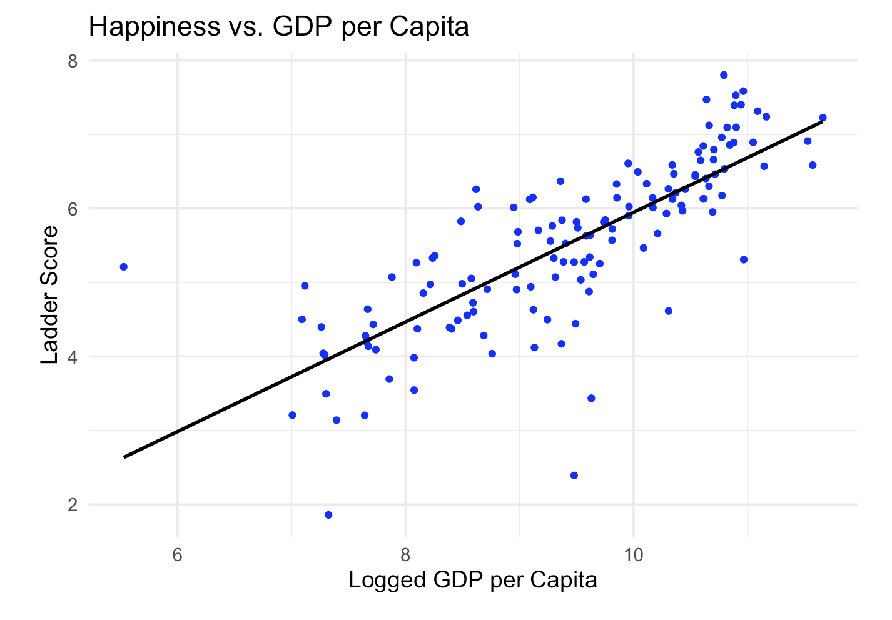
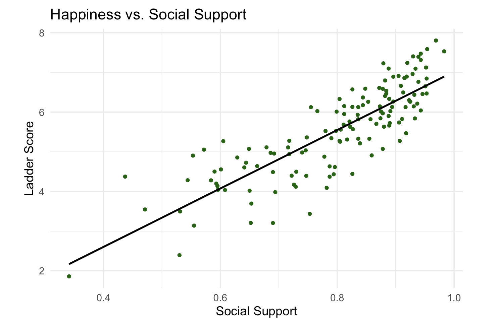

# What Drives National Happiness?
A Data-Driven Analysis of Global Well-being

This project analyzes global data from the 2023 World Happiness Report to identify key factors that influence national happiness levels using regression and clustering techniques.

---

## Problem

What factors most strongly influence happiness across countries?

While economic growth is often used as a primary indicator of well-being, it is unclear whether income alone explains differences in life satisfaction. This project aims to identify the key drivers of happiness and uncover patterns across countries.

---

## Data

The dataset comes from the 2023 World Happiness Report and includes country-level observations with the following variables:

- GDP per capita (log scale)
- Social support
- Healthy life expectancy
- Freedom to make life choices
- Generosity
- Perceptions of corruption

The outcome variable is the **Ladder Score**, representing self-reported life satisfaction on a scale from 0 to 10.

---

## Methodology

The analysis uses:

- Multiple linear regression to identify key predictors
- Model selection to retain statistically significant variables
- Principal Component Analysis (PCA) for dimensionality reduction
- K-means clustering to identify groups of countries

---

## Key Findings

The regression model explains over 80% of the variation in happiness scores.

Key drivers of happiness include:

- Social support (strongest positive effect)
- Freedom to make life choices
- GDP per capita
- Perceptions of corruption (negative effect)

Variables such as generosity and life expectancy were not statistically significant after controlling for other factors.

---

## Visualization

### GDP and Happiness

Higher GDP per capita is associated with higher happiness levels:

### Social Support and Happiness

Social support shows the strongest relationship with happiness:

---

## Structural Insights

PCA shows that the first two components explain over 80% of the variance.

Clustering analysis reveals distinct groups of countries:

- High-income, high-happiness countries
- Mid-level developing countries
- Low-income, low-happiness countries

---

## Key Takeaways

- Economic growth alone does not fully explain happiness differences
- Social support is the most important predictor of well-being
- Institutional trust and freedom play a significant role
- Data-driven insights can inform policy decisions beyond GDP
